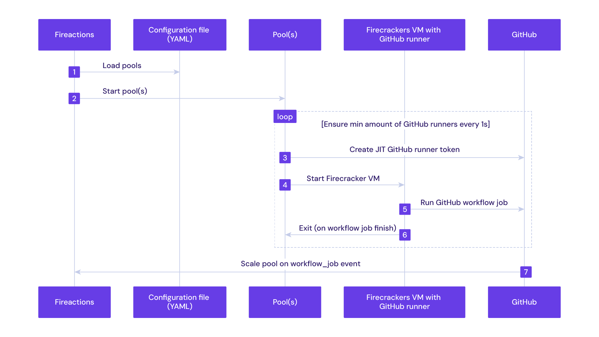

# Fireactions

[](https://goreportcard.com/report/github.com/hostinger/fireactions)


Fireactions is an orchestrator for GitHub runners. BYOM (Bring Your Own Metal) and run self-hosted GitHub runners in ephemeral, fast and secure [Firecracker](https://firecracker-microvm.github.io/) based virtual machines.

<!--
https://excalidraw.com/#json=GrJMj6LLYt39mgC0me7Di,C65TV9FhicnxNKgPeRhi3A
sequenceDiagram
    autonumber
    participant Fireactions
    participant Configuration file (YAML)
    participant Pool(s)
    participant Firecracker VM with GitHub runner
    participant GitHub

    Fireactions->>Configuration file (YAML): Load pools
    Fireactions->>Pool(s): Start pool(s)
    loop Ensure min amount of GitHub runners every 1s
        Pool(s)->>GitHub: Create JIT GitHub runner token
        Pool(s)->>Firecracker VM with GitHub runner: Start Firecracker VM
        Firecracker VM with GitHub runner->>GitHub: Run GitHub workflow job
        Firecracker VM with GitHub runner->>Pool(s): Exit (on workflow job finish)
    end
    GitHub->>Fireactions: Scale pool on workflow_job event
-->


Several key features:

- **Scalable**

  Pool based scaling approach. Fireactions always ensures the minimum amount of GitHub runners in the pool.

- **Ephemeral**

  Each virtual machine is created from scratch and destroyed after the job is finished, no state is preserved between jobs, just like with GitHub hosted runners.

- **Customizable**

  Define job labels and customize virtual machine resources to fit Your needs.

## Quickstart

Create and install a GitHub App (see [Creating a GitHub App](https://docs.github.com/en/developers/apps/creating-a-github-app)) with the following permissions:

    - Read access to metadata
    - Read and write access to actions and organization self hosted runners

Note down the GitHub App ID and generate a private key, save it to a file on the host machine, e.g. `/root/private-key.pem`.

Download and run the installation script:

    ```bash
    curl -sSL https://raw.githubusercontent.com/hostinger/fireactions/main/install.sh -o install.sh
    chmod +x install.sh
    ./install.sh \
      --github-app-id=<GITHUB_APP_ID> \
      --github-app-key-file="/root/private-key.pem" \
      --github-organization="<GITHUB_ORGANIZATION>"
      --containerd-snapshotter-device="<DEVICE>"
    ```

This creates a default configuration with a single pool named `default` with a single runner. See [Configuration](./docs/user-guide/configuration.md) for more information.

Test the installation by creating a new GitHub workflow in your repository:

```yaml
# .github/workflows/test.yaml
name: test

on:
  workflow_dispatch:
  pull_request:
      branches:
      - '*'
  push:
      branches:
      - main

jobs:
  test:
    name: test
    runs-on: # The label(s) of the Fireactions pool
    - self-hosted
    - fireactions
    steps:
    - name: Example
      run: |
        echo "Hello, Fireactions!"
```

## Contributing

See [CONTRIBUTING.md](CONTRIBUTING.md) for more information on how to contribute to Fireactions.

## License

See [LICENSE](LICENSE)
